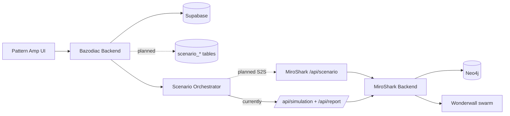
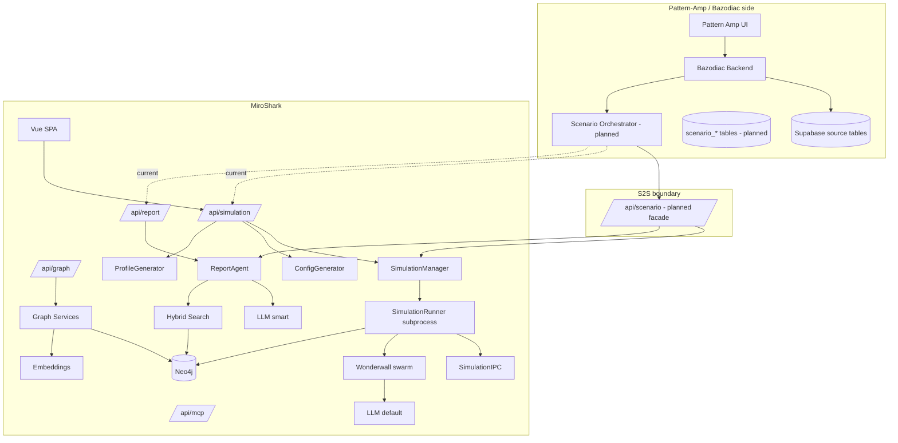

# Architecture Snapshot: MiroShark S2S

## 0. Header Block

- Project: MiroShark S2S
- Domain: agent / multi-agent simulation
- Repo: miroShark/MiroShark
- Generated: 2026-05-29
- Nodes: 26
- Edges: 38
- Documented S2S API flows: 7
- Status legend: `active` = exists in code today · `planned` = interface to design/implement

## Table of Contents

1. Introduction & Goals
2. Constraints
3. Context & Scope
4. Solution Strategy
5. Building Block View
6. Runtime View - User Flows
7. API Reference
8. Module Catalogue
9. Glossary
10. Architecture Flows

## 1. Introduction & Goals

MiroShark is a swarm-intelligence engine: a scenario (headline, policy draft, what-if) is dropped in and hundreds of AI agents simulate social-media reactions hour by hour across Twitter, Reddit and a prediction market, producing a structured report that cites simulated posts and trades.

The S2S goal is to expose MiroShark as a **scenario-simulation service for the Pattern-Amp / Bazodiac product**. Bazodiac condenses per-user Supabase data (User Base Context, Pattern Context = seven Eve hypotheses, Temporal Context) into a `ScenarioSeed.md`, hands it to MiroShark with an invariant generic prompt and a simulation config, then normalizes MiroShark's output into `ScenarioBranchV1[]` for the Pattern-Amp branch visualization.

Aim is **not** objective forecasting — it is the simulation of pattern dynamics: what amplifies, what can tip, where tension arises, where there are influenceable decision points ("Enabling Your Destiny").

## 2. Constraints

- MiroShark must receive **only** `ScenarioSeed.md` + Generic Scenario Prompt + Simulation Config. Never raw Supabase tables, service keys, or full raw dialogue/chart payloads.
- The Generic Scenario Prompt is **invariant** (rules of simulation = HOW). The Seed is **variable** (user data = WHAT). The Config sets mode/horizon (IN WHICH MODE).
- All `/api/*` routes require the `x-miroshark-internal-key` header when `MIROSHARK_INTERNAL_KEY` is set; enforcement is relaxed when `DEBUG=true`.
- Persistence is Neo4j only on the MiroShark side; there is no relational DB. `Neo4jStorage` is a singleton; endpoints return 503 gracefully when it is down.
- Simulations run as an out-of-process **subprocess** (`simulation_runner.py`) with socket IPC, not in-process.
- `wonderwall` is bundled in-tree (`backend/wonderwall/`), not a PyPI dependency — editing it changes simulation behavior directly.
- Epistemic guardrails: no external-event prediction, no diagnosis, no astrology-as-causality, no deterministic language; every branch carries a `notToInfer`. `quiz` source weight must be 0/absent in V1.

## 3. Context & Scope



System boundary: the S2S contract is the line between **Bazodiac (owns Supabase + pattern condensation + normalization)** and **MiroShark (owns simulation + report)**. Everything Pattern-Amp-specific (pattern state, seed templating, branch normalization) stays on the Bazodiac side.

## 4. Solution Strategy

- Keep MiroShark domain-neutral: it simulates from a seed + prompt + config and returns structured output. The Pattern-Amp semantics live in Bazodiac's orchestrator and normalizer.
- Introduce a thin, stable **`/api/scenario` facade** on MiroShark so Bazodiac makes one submit + two poll calls, instead of re-implementing the `prepare -> start -> run-status -> report` dance against `/api/simulation` + `/api/report`.
- Reuse the existing `SimulationManager` / `SimulationRunner` / `ReportAgent` internally behind the facade.
- Add the missing `scenario_*` persistence tables on the Supabase side for run lifecycle, dedupe (`trigger_key`), and repeatability.
- Author the contract against the already-published OpenAPI at `/api/openapi.json`.

## 5. Building Block View



## 6. Runtime View - User Flows

### Scenario run (target S2S flow)

1. Pattern Amp UI triggers a run (`manual` / `eve_hypotheses_change` / `daily_06`) with a `trigger_key`.
2. Bazodiac loads P0/P1/P2 tables from Supabase server-side.
3. Orchestrator builds Source Bundle -> `UserPatternStateV1` -> `ScenarioSeed.md`, attaches Generic Prompt + Config.
4. Orchestrator `POST /api/scenario/run` -> `{ runId }` (planned). Idempotent on `trigger_key`.
5. Orchestrator polls `GET /api/scenario/run/:runId` until `completed|failed`.
6. Orchestrator `GET /api/scenario/run/:runId/branches` -> normalizes -> `ScenarioBranchV1[]`.
7. Persist run/seed/branches in `scenario_*`; Pattern Amp UI renders the branch fan.

### Scenario run (current path, until the facade exists)

`POST /api/simulation/prepare` -> `POST /api/simulation/start` -> poll `GET /api/simulation/:id/run-status` -> `GET /api/report/by-simulation/:id` -> normalize report to branches on the Bazodiac side.

### Operator path (MiroShark SPA)

Home -> Process(:projectId) -> Simulation -> SimulationRun (live feed) -> Report; plus Interaction / Replay / Compare / Embed / Explore / Verified.

## 7. API Reference

### 7.1 Endpoint Index

| Method | Path | Module | Status | Description |
|---|---|---|---|---|
| POST | /api/scenario/run | miroshark-scenario-api | planned | Submit seed + generic prompt + config; returns runId |
| GET | /api/scenario/run/:runId | miroshark-scenario-api | planned | Scenario run status |
| GET | /api/scenario/run/:runId/branches | miroshark-scenario-api | planned | Normalized ScenarioBranchV1[] |
| POST | /api/simulation/create | api-simulation | active | Create a simulation from a project |
| POST | /api/simulation/prepare | api-simulation | active | Generate config + agent profiles |
| POST | /api/simulation/start | api-simulation | active | Spawn simulation subprocess |
| POST | /api/simulation/stop | api-simulation | active | Stop a running simulation |
| GET | /api/simulation/:simulation_id/run-status | api-simulation | active | Poll live run status |
| POST | /api/simulation/suggest-scenarios | api-simulation | active | LLM scenario suggestions |
| POST | /api/report/generate | api-report | active | Generate final report |
| GET | /api/report/by-simulation/:simulation_id | api-report | active | Report for a simulation |
| GET | /api/report/:report_id | api-report | active | Report by id |
| POST | /api/report/chat | api-report | active | Chat over a report |
| POST | /api/graph/build | api-graph | active | Build project graph |
| POST | /api/graph/ontology/generate | api-graph | active | Generate ontology |
| GET | /api/graph/data/:graph_id | api-graph | active | Read graph data |
| GET | /api/mcp/status | api-mcp | active | MCP bridge status + tool catalog |
| GET | /api/openapi.json | api-misc | active | OpenAPI spec (public) |
| GET | /api/templates/list | api-misc | active | Preset templates |
| GET | /api/observability/events/stream | api-misc | active | SSE trace/debug stream |

### 7.2 Proposed S2S contract detail (`/api/scenario`)

**`POST /api/scenario/run`** — auth: service (`x-miroshark-internal-key`)

Request:
```json
{
  "seedMarkdown": "# Scenario Seed: Pattern Amp Base Scenario ...",
  "genericPrompt": "# Generic MiroShark Scenario Prompt ...",
  "simulationConfig": {
    "mode": "current_pattern_field",
    "horizon": "now",
    "branchCountMin": 3,
    "branchCountMax": 7,
    "sourceMode": "hypotheses_only",
    "language": "de",
    "allowQuiz": false,
    "allowExternalEventPrediction": false,
    "allowDiagnosis": false
  },
  "triggerSource": { "triggerSource": "manual" },
  "triggerKey": "manual:{userId}:{mode}:{horizon}:{timestampBucket}"
}
```
Response: `{ "runId": "string", "status": "queued", "simulationId": "string|null" }`

**`GET /api/scenario/run/:runId`** -> `{ "runId", "status": "queued|running|completed|failed", "simulationId", "error": null }`

**`GET /api/scenario/run/:runId/branches`** -> `{ "runId", "branches": ScenarioBranchV1[] }` (raw report also available via `/api/report` for debugging).

`ScenarioBranchV1` fields: `id, title, summary, tendencyType, confidence, probabilityWeight, horizonRelevance, relatedHypothesisIds, sourceWeights, coherenceDelta, tensionDelta, notToInfer, reflectiveQuestion, whyAppears, whatResonates, whereFriction, increaseCoherence, epistemicLabels, visualState`.

## 8. Module Catalogue

| Module | Type | Status | Responsibility |
|---|---|---|---|
| pattern-amp-ui | ui | external | Pattern Amp frontend; renders branches |
| bazodiac-backend | external | external | Owns Supabase access + scenario pipeline + normalization |
| supabase | data | external | Per-user source tables (P0/P1/P2) |
| scenario-tables | data | planned | scenario_* run/seed/branch/event persistence |
| scenario-orchestrator | service | planned | Source Bundle -> PatternState -> Seed -> submit -> normalize |
| miroshark-scenario-api | api | planned | Stable S2S facade `/api/scenario` |
| frontend-spa | ui | active | Vue 3 operator/spectator app |
| api-simulation | api | active | Simulation lifecycle (create/prepare/start/stop/status) |
| api-report | api | active | Report generation + retrieval + chat |
| api-graph | api | active | Project graph + ontology build |
| api-mcp | api | active | MCP bridge + tool catalog |
| api-misc | api | active | Templates/settings/observability/feed/docs/public pages |
| simulation-manager | service | active | Orchestrates simulation state |
| simulation-runner | service | active | Spawns subprocess per run |
| simulation-ipc | service | active | Socket IPC to run subprocess |
| config-generator | service | active | Builds Wonderwall run config |
| profile-generator | service | active | Generates agent personas (optional demographic grounding) |
| report-agent | agent | active | LLM report + ontology (SMART tier) |
| graph-services | service | active | Ontology, builder, memory updater, tools |
| notification-services | external | active | Discord/Slack/Telegram/Email/Webhook/Push + publishers |
| wonderwall | workflow | active | Bundled camel-oasis multi-agent swarm |
| neo4j | data | active | Single graph store (state + episodic memory) |
| search-service | infra | active | Hybrid vector + BM25 + graph + rerank |
| embedding-service | infra | active | OpenAI-compatible / Ollama embeddings |
| llm-default | external | active | Cheap/fast tier (personas, config, compaction) |
| llm-smart | external | active | Strong tier (reports, ontology) |

## 9. Glossary

| Term | Meaning |
|---|---|
| S2S | Service-to-Service: the boundary between Bazodiac and MiroShark |
| Scenario Seed | `ScenarioSeed.md` — the WHAT (user data, hypotheses, context) sent to MiroShark |
| Generic Scenario Prompt | Invariant rules — the HOW of the simulation |
| UserPatternStateV1 | Condensed pattern state built from Supabase raw tables |
| ScenarioBranchV1 | Normalized output branch rendered by Pattern Amp |
| Wonderwall | Bundled multi-agent social simulation framework (camel-oasis fork) |
| trigger_key | Idempotency key preventing duplicate scenario runs |
| Node | Architecture component: service, view, agent, data store, or external system |
| Edge | Relationship: API call, data flow, event, or dependency |

## 10. Architecture Flows

Only real service-to-service calls are listed (UI->API, DB reads, internal Ollama/LLM calls, and pure dependency edges are excluded). Sorted by source, target, path.

### Flow: scenario-orchestrator → api-report
- Source: scenario-orchestrator
- Target: api-report
- Method: GET
- Path: /api/report/by-simulation/:simulation_id
- Description: Current-path option — fetch final report, then normalize to ScenarioBranchV1[] on the Bazodiac side.
- Critical: false

### Flow: scenario-orchestrator → api-simulation
- Source: scenario-orchestrator
- Target: api-simulation
- Method: GET
- Path: /api/simulation/:simulation_id/run-status
- Description: Current-path option — poll run status until completed/failed.
- Critical: false

### Flow: scenario-orchestrator → api-simulation
- Source: scenario-orchestrator
- Target: api-simulation
- Method: POST
- Path: /api/simulation/prepare
- Description: Current-path option — prepare a run (config + profiles) until /api/scenario exists.
- Critical: false

### Flow: scenario-orchestrator → api-simulation
- Source: scenario-orchestrator
- Target: api-simulation
- Method: POST
- Path: /api/simulation/start
- Description: Current-path option — start the run subprocess.
- Critical: false

### Flow: scenario-orchestrator → miroshark-scenario-api
- Source: scenario-orchestrator
- Target: miroshark-scenario-api
- Method: GET
- Path: /api/scenario/run/:runId
- Description: Poll scenario run status (planned S2S facade).
- Critical: true

### Flow: scenario-orchestrator → miroshark-scenario-api
- Source: scenario-orchestrator
- Target: miroshark-scenario-api
- Method: GET
- Path: /api/scenario/run/:runId/branches
- Description: Fetch normalized ScenarioBranchV1[] (planned S2S facade).
- Critical: true

### Flow: scenario-orchestrator → miroshark-scenario-api
- Source: scenario-orchestrator
- Target: miroshark-scenario-api
- Method: POST
- Path: /api/scenario/run
- Description: Submit ScenarioSeed.md + generic prompt + simulation config; returns runId (planned S2S facade, idempotent on trigger_key).
- Critical: true
